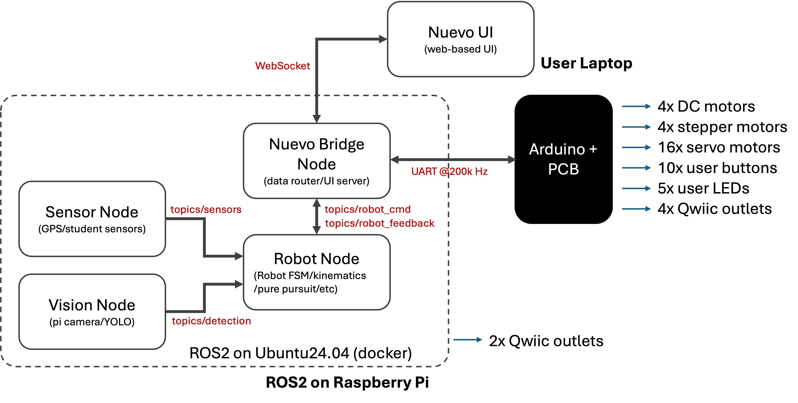

# NUEVO Board and Firmware Manual

**NUEVO** = **N**avigation **U**nit for **E**ducation and **V**ersatile **O**perations
**Board Revision:** Rev. B · **Firmware:** v0.9.7

---

## Table of Contents

1. [System Architecture Overview](#1-system-architecture-overview)
2. [Getting Started](#2-getting-started)
3. [NUEVO Board Hardware](#3-nuevo-board-hardware)
4. [NUEVO UI](#4-nuevo-ui)
5. [Firmware](#5-firmware)
6. [Software — ROS2 Nodes](#6-software--ros2-nodes)
7. [Sensors and I2C Devices](#7-sensors-and-i2c-devices)
8. [Communication Protocol](#8-communication-protocol)
9. [Safety and Fault Handling](#9-safety-and-fault-handling)
10. [Troubleshooting](#10-troubleshooting)
11. [Appendix A: config.h Quick Reference](#appendix-a-configh-quick-reference)
12. [Appendix B: Pin Table (Rev. B)](#appendix-b-pin-table-rev-b)

---

## 1. System Architecture Overview



The NUEVO platform has four major components that work together:

- **NUEVO Board** — the custom PCB that integrates power management, motor drivers, and signal routing for all actuators and sensors
- **Firmware** — C++ code running on the Arduino Mega 2560 that handles real-time motor control, encoder counting, IMU, and low-level safety
- **NUEVO Bridge / UI** — a Python backend (`nuevo_bridge`) and React web frontend that provide teleoperation, monitoring, and configuration
- **ROS2 Nodes** — a ROS2 workspace on the Raspberry Pi 5 that wraps the same bridge runtime for use in ROS-based systems

The Arduino and the Raspberry Pi communicate through a UART serial link using a compact TLV (Type-Length-Value) protocol at 200 kbps. The Raspberry Pi is the high-level controller for decision-making and path planning; the Arduino is the low-level controller for real-time actuation and safety enforcement.

```
  [ Browser / ROS2 client ]
          |
    WebSocket / ROS topics
          |
  [ nuevo_bridge (FastAPI, Python) ]  ← runs on Raspberry Pi 5
          |
    UART Serial @ 200 kbps (TLV protocol)
          |
  [ Arduino Mega 2560 firmware ]  ← runs on NUEVO Board
          |
  [ Motors · Encoders · Steppers · Servos · IMU · LEDs · Buttons ]
```

---

## 2. Getting Started

### 2.1 Before You Power Up

- [ ] Visually inspect the PCB for damage, solder bridges, or loose components
- [ ] Verify all plug-in modules are properly seated: both H-bridge modules, all stepper driver modules, and the PCA9685 servo controller
- [ ] Check that the 15A blade fuse is installed
- [ ] Ensure the main power switch is in the OFF position
- [ ] If using servos, confirm the servo rail voltage is appropriate for your servos (see [Section 3.6](#36-servo-motors))

### 2.2 Power Sources

The board supports two mutually compatible power inputs:

| Source | Connector | Voltage Range | Notes |
|--------|-----------|---------------|-------|
| Battery | XT60 female (J_BAT) | 7.4 V – 24 V | Powers all motors; 12V NiMH (10-cell) is default |
| Raspberry Pi USB-C | RPi port | 5V via RPi | Powers Arduino and RPi only; motors not powered |

An ideal-diode circuit prevents backflow between the two sources, so they can be connected simultaneously. Use the USB-C path during software development when the battery is not needed.

> **H-bridge voltage limit:** The default H-bridge modules support a **maximum of 12V**. If using a battery above 12V (4S LiPo or higher), replace the H-bridge modules with higher-voltage rated alternatives (e.g. BTS7960 for up to 27V) before connecting.

### 2.3 First Power-Up

1. Connect the battery or plug in the RPi USB-C cable
2. Flip the main power switch ON
3. Verify LEDs:
   - **5V rail LED** (green) — should illuminate; confirms the buck converter is active
   - **Servo rail LED** (green) — should illuminate if the servo rail jumper is closed
   - **Power-good LED** — illuminates when 5V is provided by the on-board buck converter (not when backfed from USB-C)
4. Upload firmware to the Arduino via USB-B (see [Section 5.2](#52-build-and-upload))
5. Once firmware is running, the NeoPixel RGB LED on pin 42 will show system state — it should show the IDLE color shortly after boot
6. Connect the Raspberry Pi and start the bridge to begin communicating (see [Section 4.2](#42-starting-the-bridge))

### 2.4 Accessing the Web UI

Once the bridge is running on the Raspberry Pi, the NUEVO UI is accessible from any browser on the same network:

```
http://<raspberry-pi-ip>:8000
```

If running on the development machine with the Docker VM compose file (no hardware), the UI is at:

```
http://localhost:8000
```

---

## 3. NUEVO Board Hardware

### 3.1 Power Rails

The board provides three regulated output rails derived from the battery input:

| Rail | Voltage | Max Current | Consumers |
|------|---------|-------------|-----------|
| 5V_SYS | 5.0V (regulated) | 6A | Raspberry Pi 5, Arduino, encoders, logic |
| 3V3_SYS | 3.3V (LDO from 5V) | 1A | Qwiic devices on Arduino bus |
| SERVO_VOUT | 5–10V (adjustable) | 6A | PCA9685 and all servo motors |

Power path from battery:
1. XT60 connector → P-channel MOSFET (reverse-polarity protection)
2. → 15A replaceable blade fuse
3. → TVS2700DRVR surge clamp (27V flat)
4. → Dual DC-DC buck converters (5V_SYS and SERVO_VOUT)
5. → AMS1117-3.3 LDO (3V3_SYS from 5V_SYS)

The 5V_SYS rail can also be backfed from the Raspberry Pi's USB-C port through an ideal-diode circuit, allowing the Arduino to run without a battery connected.

Upper screw terminal power outputs (for external connections):

| Label | Available outputs | Voltage |
|-------|-------------------|---------|
| GND | 8 terminals | Ground |
| BAT | 4 terminals | Battery voltage (7.4–24V) |
| 3V3_SYS | 4 terminals | 3.3V (1A shared) |
| 5V_SYS | 4 terminals | 5V (6A shared) |
| SERVO_VOUT | 4 terminals | Adjustable 5–10V (6A shared) |

### 3.2 Raspberry Pi 5

- Installed at the bottom-left corner of the board
- Powered from 5V_SYS (battery or USB-C)
- Communicates with the Arduino through UART Serial2 via a 5V ↔ 3.3V level shifter
  - Arduino TX2 (pin 16) → RPi GPIO15 (RXD)
  - Arduino RX2 (pin 17) ← RPi GPIO14 (TXD)
  - Default baud rate: **200,000 bps**
- The RPi's own I2C1 bus (GPIO2/GPIO3) connects to two dedicated Qwiic headers — these are separate from the Arduino's I2C bus
- The 40-pin GPIO header is otherwise available for general use

### 3.3 Arduino Mega 2560

The Arduino is the low-level real-time controller. It handles:
- DC motor PWM, direction, and encoder feedback
- Stepper motor step/direction/enable pulses
- Servo motor commands via PCA9685 over I2C
- IMU and voltage monitoring
- User buttons, limit switches, and LED outputs
- TLV communication with the Raspberry Pi over Serial2

It is programmed via the USB-B port on the board. See [Section 5](#5-firmware) for firmware installation.

> **Serial port reservations:** Serial1 (pins 18/19) is used for M2 encoder interrupts and is not available. Serial3 (pins 14/15) is used for stepper STEP signals and is not available.

### 3.4 DC Motors

The board supports up to four DC motors with quadrature encoder feedback, driven by two dual-channel H-bridge modules.

- **Channels M1 and M2** — encoder phases on dedicated hardware interrupt pins (INT0/INT1 for M1, INT4/INT5 for M2), enabling full 4× quadrature decoding at up to ~9600 edges/second at 100 RPM
- **Channels M3 and M4** — encoder phases on Pin Change Interrupt (PCINT) pins; also full 4× mode
- Encoder resolution: 1440 PPR (manufacturer spec), which gives 1440 counts/revolution in 4× mode
- Current sensing is available on all four channels (analog pins A3–A6), disabled by default

Each encoder connects to the board through a 4-pin keyed connector (VCC, GND, A, B). See [firmware/docs/encoder_ISR.md](../../firmware/docs/encoder_ISR.md) for full details on the interrupt and counting implementation.

Motor control in the firmware uses a cascaded PID loop. See [firmware/docs/motion_control.md](../../firmware/docs/motion_control.md) for details.

### 3.5 Stepper Motors

The board has four on-board sockets for A4988 or DRV8825 stepper driver modules.

- Each driver has a blue LED indicator: **LED on = driver enabled**
- Enable each driver by inserting the EN jumper header under the driver socket; the firmware will also enable/disable the driver programmatically
- Microstepping is configured via three jumpers per driver (MS1, MS2, MS3):

| MS1 | MS2 | MS3 | A4988 Mode | DRV8825 Mode |
|-----|-----|-----|------------|--------------|
| Open | Open | Open | Full step | Full step |
| Closed | Open | Open | 1/2 | 1/2 |
| Open | Closed | Open | 1/4 | 1/4 |
| Closed | Closed | Open | 1/8 | 1/8 |
| Closed | Closed | Closed | 1/16 | 1/32 |

> **Maximum step rate:** The firmware stepper timer runs at 10 kHz, giving a maximum of 5000 steps/second per motor. Factor in your microstepping setting when calculating maximum RPM.

#### Current Limit Setting

Each A4988 and DRV8825 module has a small trimmer potentiometer on the top surface used to set the maximum coil current. Setting this correctly is important: too low and the motor loses torque or stalls; too high and the driver or motor overheats.

The current limit is set by measuring the **VREF voltage** at the potentiometer wiper (or the dedicated test point on the module) relative to GND with a multimeter, then adjusting until the target voltage is reached.

**A4988** — current limit formula:

$$I_{max} = \frac{V_{REF}}{8 \times R_{CS}}$$

where $R_{CS}$ is the current-sense resistor value on the module (typically **0.050 Ω** on most breakout boards, sometimes 0.068 Ω or 0.100 Ω — check your board's silkscreen or datasheet).

| $R_{CS}$ | $V_{REF}$ for 1.0 A | $V_{REF}$ for 1.5 A | $V_{REF}$ for 2.0 A |
|----------|---------------------|---------------------|---------------------|
| 0.050 Ω | 0.40 V | 0.60 V | 0.80 V |

**DRV8825** — current limit formula:

$$I_{max} = \frac{V_{REF}}{2 \times R_{CS}}$$

where $R_{CS}$ is typically **0.100 Ω** on Pololu-style DRV8825 modules.

| $R_{CS}$ | $V_{REF}$ for 1.0 A | $V_{REF}$ for 1.5 A | $V_{REF}$ for 2.0 A |
|----------|---------------------|---------------------|---------------------|
| 0.100 Ω | 0.20 V | 0.30 V | 0.40 V |

**Procedure:**

1. Power the board (the motor does not need to be moving)
2. Place the multimeter negative probe on GND
3. Touch the positive probe to the VREF test point on the driver module (the center of the trimmer pot on A4988; the dedicated via/pad on DRV8825)
4. Turn the trimmer slowly clockwise to increase VREF (increases current), counterclockwise to decrease
5. Set VREF to the value corresponding to your target current from the tables above
6. Do not exceed the stepper motor's rated current — check the motor datasheet

> **Note:** When using microstepping, the A4988 automatically reduces current on idle phases. The DRV8825 does not — consider setting the current limit to ~70% of rated current if the driver runs hot in microstepping mode.

> **Thermal caution:** Always attach the heatsink to the driver IC before running motors. Both the A4988 and DRV8825 will thermal-shutdown around 150°C without a heatsink at moderate currents.

### 3.6 Servo Motors

Servos are driven by the PCA9685 I2C PWM controller, which supports up to 16 channels.

- The PCA9685 connects to the Arduino's I2C bus (pins 20/21, shared with the IMU)
- Servo power (SERVO_VOUT) is connected to the PCA9685 VCC rail via the `JP_SERVO_PWR` jumper (closed by default)
- Adjust the servo rail voltage with the `POT_SERVO` trimmer potentiometer:
  - Clockwise increases voltage; counterclockwise decreases
  - Typical settings: 5–6V for standard analog servos, 6–7.4V for high-torque servos
  - Measure at the servo rail test point with a multimeter before connecting servos
- Servos plug into the PCA9685 module directly, not into the main PCB

> **Voltage warning:** Most standard servos are rated for 4.8–6V. Do not exceed the servo's rated voltage.

### 3.7 Limit Switches and User Buttons

The board has 10 user button inputs and 8 limit switch inputs. Buttons 3–10 and limit switches 1–8 share the same Arduino input pins — each dual-purpose connector has both an on-board tactile button and a 3-pin JST XH connector for an external switch.

| Button | Limit Switch | Arduino Pin | Notes |
|--------|-------------|-------------|-------|
| BTN1 | — | 38 | Dedicated on-board button only |
| BTN2 | — | 39 | Dedicated on-board button only |
| BTN3 | LIM1 | 40 | Dual-purpose: button + external connector |
| BTN4 | LIM2 | 41 | Dual-purpose: button + external connector |
| BTN5 | LIM3 | 48 | Dual-purpose: button + external connector |
| BTN6 | LIM4 | 49 | Dual-purpose: button + external connector |
| BTN7 | LIM5 | 50 | Dual-purpose: button + external connector |
| BTN8 | LIM6 | 51 | Dual-purpose: button + external connector |
| BTN9 | LIM7 | 52 | Dual-purpose: button + external connector |
| BTN10 | LIM8 | 53 | Dual-purpose: button + external connector |

All inputs use `INPUT_PULLUP` — they read HIGH when not activated and LOW when pressed or triggered.

The voltage supplied to the external limit switch connectors is selected globally by the `JP_LIM_V` jumper:
- **Position 1-2:** 5V (default; suits mechanical switches and most optical endstops)
- **Position 2-3:** 3.3V (for low-voltage Hall effect or proximity sensors)

Limit switches can be assigned to stepper motors or DC motors for homing in `config.h`:

```c
#define PIN_ST1_LIMIT   PIN_LIM1  // Stepper 1 homing switch
#define PIN_M1_LIMIT    PIN_LIM5  // DC motor 1 homing switch
```

> **Caution:** Because buttons and limit switches share the same pins, do not press on-board buttons while the firmware is using those pins for limit-switch homing. Account for this in any custom firmware logic that reads button or limit-switch state.

### 3.8 Status and User LEDs

| LED | Color | Pin | PWM | Firmware function |
|-----|-------|-----|-----|-------------------|
| LED1 | Green | 44 | Yes | System OK / user-controlled |
| LED2 | Red | 5 | No | Error / low battery |
| LED3 | Blue | 45 | Yes | User-controlled (exposed) |
| LED4 | Orange | 46 | Yes | User-controlled (exposed) |
| LED5 | Purple | 47 | No | User-controlled (exposed) |
| NeoPixel | RGB | 42 | — | Automatic system-state indicator |

> **Note:** LED2 (pin 5) and LED5 (pin 47) are digital ON/OFF only — they cannot be dimmed via PWM due to timer conflicts with the stepper and DC motor control hardware.

The **NeoPixel** (WS2812B) on pin 42 automatically reflects the firmware system state and is not user-controlled. An extension socket (`J_NEOPIXEL`) allows external RGB strips to share the same data line.

### 3.9 I2C and Qwiic Connectors

| Connector | Bus | Voltage | Location |
|-----------|-----|---------|----------|
| J_QWIIC_1 – J_QWIIC_4 | Arduino I2C (pins 20/21) | 3.3V (level-shifted) | Arduino side |
| J_QWIIC_RPI1, J_QWIIC_RPI2 | RPi I2C1 (GPIO2/GPIO3) | 3.3V (native) | RPi side |

The Arduino-side Qwiic connectors use a TXS0102 level shifter (5V ↔ 3.3V). All four Arduino Qwiic connectors are on the same I2C bus and are fully compatible with the standard Qwiic/STEMMA QT pinout:

| Pin | Color | Signal |
|-----|-------|--------|
| 1 | Black | GND |
| 2 | Red | 3.3V |
| 3 | Blue | SDA |
| 4 | Yellow | SCL |

The RPi-side Qwiic connectors are a completely separate bus from the Arduino-side connectors. Sensors intended for ROS2 use (lidar, ultrasonic) should connect to the RPi-side connectors. Sensors intended for the Arduino firmware (IMU) connect to the Arduino-side connectors.

---

## 4. NUEVO UI

### 4.1 Overview

The NUEVO UI is a web-based interface for teleoperation, monitoring, and configuration. It consists of two components:

- **nuevo_bridge** — a Python backend (`nuevo_ui/backend/nuevo_bridge`) that owns the serial connection to the Arduino, decodes TLV packets, and serves a FastAPI + WebSocket API
- **Frontend** — a React/TypeScript single-page application (`nuevo_ui/frontend`) that connects to the bridge via WebSocket

The bridge can run in two modes:
- **Plain Python mode** — standalone, no ROS2 required; accessed via browser only
- **ROS mode** — the same bridge runtime also publishes/subscribes to ROS2 topics; see [Section 6](#6-software--ros2-nodes)

### 4.2 Starting the Bridge

The recommended workflow uses Docker:

**Build the frontend first** (required once, or after any frontend changes):

```bash
cd nuevo_ui/frontend
npm install
npm run build
cd ../..
cp -r nuevo_ui/frontend/dist/. nuevo_ui/backend/static/
```

**On the Raspberry Pi (with hardware):**

```bash
docker compose -f ros2_ws/docker/docker-compose.rpi.yml build
docker compose -f ros2_ws/docker/docker-compose.rpi.yml up
```

**On macOS/Windows (mock bridge, no hardware needed):**

```bash
docker compose -f ros2_ws/docker/docker-compose.vm.yml build
docker compose -f ros2_ws/docker/docker-compose.vm.yml up
```

The UI will be available at `http://localhost:8000` (or the RPi's IP on the real hardware).

### 4.3 UI Overview

The web interface provides the following panels:

- **System State** — displays the current firmware state (IDLE, RUNNING, ERROR, ESTOP) and battery/5V/servo rail voltages; contains the START, STOP, RESET, and ESTOP buttons
- **DC Motor Control** — per-motor velocity, position, or PWM setpoints; live encoder tick count and speed readback; enable/disable toggles
- **Stepper Control** — per-motor target position, speed, and enable toggles; homing trigger
- **Servo Control** — per-channel angle or pulse-width sliders (channels 0–15)
- **Sensors** — IMU orientation (roll/pitch/yaw), acceleration, gyroscope; odometry position (x, y, θ); voltage monitoring
- **I/O** — button/limit switch states; LED output controls
- **Magnetometer Calibration** — start/stop calibration sampling, save to persistent storage

### 4.4 Odometry

The firmware computes differential-drive odometry from the two designated wheel motor encoders. The relevant configuration in `config.h`:

```c
#define ODOM_LEFT_MOTOR   0    // DC motor index (0-based) for left wheel
#define ODOM_RIGHT_MOTOR  1    // DC motor index (0-based) for right wheel
#define WHEEL_DIAMETER_MM 74.0f
#define WHEEL_BASE_MM     333.0f
```

Odometry is updated at 200 Hz and streamed to the bridge as `SENSOR_KINEMATICS` telemetry. The coordinate frame follows the right-hand 2D convention: **+X is forward, +Y is left**. Initial heading `θ` defaults to 90° (facing the +Y axis) and can be overridden with `INITIAL_THETA` in `config.h`.

Odometry can be reset to zero at any time via the `SYS_ODOM_RESET` command from the UI or bridge API.

---

## 5. Firmware

### 5.1 Prerequisites

- **Arduino IDE 2.x** (or arduino-cli)
- **Arduino AVR Boards core** installed in the IDE (Boards Manager → search "Arduino AVR Boards")
- **Board target:** Arduino Mega or Mega 2560

**Required: serial buffer size configuration**

The stock AVR serial buffers are too small for the high-rate UART link to the Raspberry Pi. This must be set before the first build or you will see UART overrun errors at runtime.

Create (or edit) `platform.local.txt` in your Arduino AVR core directory:

```text
compiler.cpp.extra_flags=-DSERIAL_RX_BUFFER_SIZE=512 -DSERIAL_TX_BUFFER_SIZE=256
```

Typical locations:

| OS | Path |
|----|------|
| Windows | `C:\Users\<user>\AppData\Local\Arduino15\packages\arduino\hardware\avr\<version>\platform.local.txt` |
| macOS | `~/Library/Arduino15/packages/arduino/hardware/avr/<version>/platform.local.txt` |
| Linux | `~/.arduino15/packages/arduino/hardware/avr/<version>/platform.local.txt` |

If the Arduino AVR Boards version changes, verify the file still exists under the new versioned directory.

### 5.2 Build and Upload

**Arduino IDE:**

1. Open `firmware/arduino/arduino.ino`
2. Select board: `Arduino Mega or Mega 2560`
3. Select the correct port (the Arduino's USB-B port)
4. Click **Verify** to build
5. Click **Upload**

**arduino-cli (optional):**

```bash
arduino-cli compile --fqbn arduino:avr:mega firmware/arduino
arduino-cli upload --fqbn arduino:avr:mega -p /dev/ttyUSB0 firmware/arduino
```

Replace `/dev/ttyUSB0` with the correct port for your OS (e.g. `/dev/cu.usbmodem...` on macOS, `COM3` on Windows).

### 5.3 Key Configuration (`config.h`)

All user-facing compile-time settings are in `firmware/arduino/src/config.h`. The most commonly adjusted settings are:

**Robot geometry** — must match your physical robot:

```c
#define WHEEL_DIAMETER_MM   74.0f    // outer diameter of drive wheels (mm)
#define WHEEL_BASE_MM       333.0f   // center-to-center track width (mm)
#define ODOM_LEFT_MOTOR     0        // DC motor index for left wheel (0-based)
#define ODOM_RIGHT_MOTOR    1        // DC motor index for right wheel (0-based)
```

**Battery type** — prevents over-discharge and sets voltage warning thresholds:

```c
#define BATTERY_TYPE    BATTERY_NIMH_10CELL  // change to match your battery
// Options: BATTERY_NIMH_8CELL, BATTERY_NIMH_10CELL,
//          BATTERY_LIPO_2S through BATTERY_LIPO_6S, BATTERY_CUSTOM
```

**Encoder direction** — set to 1 if positive motor PWM produces a negative encoder count:

```c
#define ENCODER_1_DIR_INVERTED  0
#define ENCODER_2_DIR_INVERTED  0
#define ENCODER_3_DIR_INVERTED  1
#define ENCODER_4_DIR_INVERTED  1
```

**Motor direction** — set to 1 if the H-bridge wiring makes the motor spin backwards:

```c
#define DC_MOTOR_1_DIR_INVERTED 1
#define DC_MOTOR_2_DIR_INVERTED 1
```

See [Appendix A](#appendix-a-configh-quick-reference) for a full table of tunable settings.

### 5.4 Firmware Architecture

The firmware uses a two-tier scheduling architecture:

**Hard real-time ISRs** (interrupts — unaffected by anything in `loop()`):

| ISR | Rate | Purpose |
|-----|------|---------|
| Encoder INT/PCINT | edge-driven | count quadrature encoder transitions |
| TIMER1_OVF_vect | 800 Hz | DC motor latch/apply (one motor per tick, 200 Hz per motor) |
| TIMER3_OVF_vect | 10 kHz | stepper pulse generation |

**Soft tasks** (millis-based, run in `loop()`, can be preempted by ISRs):

| Task | Rate | Purpose |
|------|------|---------|
| taskUART | 100 Hz | UART RX/TX service, heartbeat, telemetry packing |
| taskMotorFeedback | 200 Hz | refresh encoder-derived position/velocity cache |
| taskSafety | 100 Hz | heartbeat timeout and battery fault evaluation |
| taskSensors | 100 Hz | IMU, voltage monitoring, button/limit sampling |
| taskUserIO | 20 Hz | LED animations, NeoPixel rendering |

This separation ensures that PID and stepper timing are never delayed by slow tasks like I2C reads or TLV parsing. No I2C, UART, or EEPROM operations are allowed inside ISR handlers.

For deeper reading, see [firmware/docs/architecture.md](../../firmware/docs/architecture.md).

---

## 6. Software — ROS2 Nodes

### 6.1 Overview

The ROS2 workspace (`ros2_ws/`) runs on the Raspberry Pi and provides a ROS-native interface to the robot. It is built on the same `nuevo_bridge` Python runtime used by the web UI, so the UI and ROS always share the same decoded firmware state and command path.

**When running in ROS mode, a single integrated process owns:**
- one serial connection to the Arduino
- one TLV decode pipeline
- one FastAPI/WebSocket UI server
- one ROS node

This prevents the serial port from being opened twice.

### 6.2 Package Structure

```
ros2_ws/src/
├── bridge_interfaces/   # Custom ROS message and service definitions
├── bridge/              # ROS wrapper node around the nuevo_bridge runtime
├── robot/               # Main robot logic, launch files, URDF, RViz config
├── sensors/             # RPi-connected sensor nodes (lidar, ultrasonic)
└── vision/              # Camera and perception pipeline
```

The shared Python runtime lives outside `ros2_ws`:

```
nuevo_ui/backend/nuevo_bridge/   # Transport, TLV codec, web backend
```

### 6.3 Raspberry Pi Setup

**Enable UART on the Pi 5:**

Edit `/boot/firmware/config.txt` and add:

```
enable_uart=1
dtoverlay=uart0-pi5
```

Edit `/boot/firmware/cmdline.txt` and remove any `console=serial0,...` or `console=ttyAMA0,...` entries, then reboot.

Verify the UART device is present:

```bash
ls -l /dev/ttyAMA0
```

The bridge expects `/dev/ttyAMA0` at **200,000 baud**.

### 6.4 Starting the ROS Bridge (Docker — Recommended)

Build the frontend once before starting (see [Section 4.2](#42-starting-the-bridge)).

**On the Raspberry Pi:**

```bash
docker compose -f ros2_ws/docker/docker-compose.rpi.yml build
docker compose -f ros2_ws/docker/docker-compose.rpi.yml up
```

**On macOS/Windows (mock bridge):**

```bash
docker compose -f ros2_ws/docker/docker-compose.vm.yml build
docker compose -f ros2_ws/docker/docker-compose.vm.yml up
```

Useful Docker commands:

```bash
docker compose -f <compose-file> down          # stop the stack
docker compose -f <compose-file> build         # rebuild after dependency changes
docker compose -f <compose-file> down -v       # clean build cache
docker compose -f <compose-file> logs -f       # stream logs
```

### 6.5 Key ROS Topics and Services

Topics follow the same lowercase snake_case naming as the TLV protocol:

| Topic | Direction | Description |
|-------|-----------|-------------|
| `/sys_state` | publish | firmware system state and timestamps |
| `/sys_power` | publish | battery, 5V, servo rail voltages |
| `/dc_state_all` | publish | all DC motor positions, velocities, PWM |
| `/step_state_all` | publish | all stepper positions and states |
| `/sensor_imu` | publish | IMU orientation, acceleration, gyroscope |
| `/sensor_kinematics` | publish | odometry: x, y, θ |
| `/dc_set_velocity` | subscribe | set DC motor target velocity (ticks/s) |
| `/dc_set_pwm` | subscribe | set DC motor direct PWM |
| `/set_firmware_state` | service | transition firmware state (IDLE/RUNNING/ESTOP) |

Example commands:

```bash
# Transition to RUNNING state (2)
ros2 service call /set_firmware_state bridge_interfaces/srv/SetFirmwareState "{target_state: 2}"

# Set motor 1 velocity to 200 ticks/s
ros2 topic pub --once /dc_set_velocity bridge_interfaces/msg/DCSetVelocity \
  "{motor_number: 1, target_ticks: 200}"

# Monitor odometry
ros2 topic echo /sensor_kinematics
```

### 6.6 Manual Shell Workflow (without Docker autostart)

```bash
docker compose -f ros2_ws/docker/docker-compose.rpi.yml run --rm --entrypoint bash robot

# Inside the container:
source /opt/ros/jazzy/setup.bash
colcon build --symlink-install --cmake-args -DBUILD_TESTING=OFF
source install/setup.bash
ros2 run bridge bridge
```

### 6.7 Native Ubuntu 24.04 (without Docker)

```bash
cd ros2_ws
source /opt/ros/jazzy/setup.bash
export NUEVO_BRIDGE_SOURCE="$(pwd)/../nuevo_ui/backend"
colcon build --symlink-install
source install/setup.bash
ros2 run bridge bridge
```

---

## 7. Sensors and I2C Devices

### 7.1 IMU (ICM-20948)

The ICM-20948 is a 9-DoF IMU (accelerometer + gyroscope + magnetometer) connected to the Arduino's I2C bus via a Qwiic connector.

- **I2C address:** 0x69 (AD0 pin HIGH; `IMU_AD0_VAL = 1` in `config.h`)
- **Update rate:** 25 Hz (alternating raw read and Fusion update each at 100 Hz task rate)
- **Fusion library:** Madgwick-based AHRS (`lib/Fusion`)
  - 6-DoF mode (accel + gyro) when magnetometer is uncalibrated
  - 9-DoF mode (accel + gyro + mag) when valid magnetometer calibration is stored
- **Output:** roll, pitch, yaw (degrees); raw acceleration (g); raw gyroscope (dps)
- **Full-scale settings:** ±2g accelerometer, ±250 dps gyroscope (configured in `config.h`)

The IMU must be on an **Arduino-side Qwiic connector** (J_QWIIC_1 through J_QWIIC_4), not the RPi-side connectors.

### 7.2 Magnetometer Calibration

Without magnetometer calibration, the IMU runs in 6-DoF mode and yaw will drift over time. Calibration collects hard-iron offset samples while the robot is rotated through all orientations, then saves them to EEPROM.

**Calibration procedure:**

1. Open the NUEVO UI and navigate to the **Magnetometer Calibration** panel (or use the bridge API / ROS topic)
2. Click **Start Calibration**
3. Rotate the robot slowly through all orientations — roll it, pitch it, and yaw it in full circles — for at least 10–20 seconds (minimum 50 samples required, set by `MAG_CAL_MIN_SAMPLES`)
4. Click **Save Calibration** — offsets are saved to EEPROM and will reload automatically on next boot
5. To clear a saved calibration, click **Clear Calibration**

Calibration is persistent across power cycles. If the robot's magnetic environment changes significantly (e.g. new metal chassis, different mounting location), redo the calibration.

### 7.3 Voltage Monitoring

The firmware samples three voltage rails at 10 Hz via the Arduino ADC:

| Rail | Pin | Divider | Measured range |
|------|-----|---------|----------------|
| Battery (VBAT) | A0 | 1:6 (50kΩ/10kΩ) | ~0–30V |
| 5V rail | A1 | 1:2 | ~0–10V |
| Servo rail (VSERVO) | A2 | 1:3 | ~0–15V |

Battery thresholds (configurable via `BATTERY_TYPE` in `config.h`):
- **Warning threshold:** NeoPixel turns yellow, fault flag set in telemetry
- **Cutoff threshold:** all motors disabled (same effect as heartbeat loss)
- **Minimum present threshold (2.0V):** below this voltage all actuator enable commands are silently rejected — prevents operation with no battery connected

### 7.4 Adding Qwiic Devices

To add a custom I2C sensor:

1. Connect to any available Arduino-side Qwiic connector (J_QWIIC_1 through J_QWIIC_4)
2. Verify the sensor's I2C address does not conflict with existing devices:
   - IMU: 0x69
   - PCA9685: 0x40 (default)
3. Add a driver in `firmware/arduino/src/drivers/` and register it in `SensorManager`
4. I2C access **must not** occur inside any ISR — only in soft-task context (e.g. inside `SensorManager::tick()`)

For sensors intended for use with ROS2 only (lidar, ultrasonic), connect to the RPi-side Qwiic connectors (J_QWIIC_RPI1/RPI2) instead and implement the driver in `ros2_ws/src/sensors/`.

---

## 8. Communication Protocol

The Arduino and Raspberry Pi communicate over UART (Serial2) using a compact TLV (Type-Length-Value) framing protocol.

**Physical layer:**
- UART Serial2, pins 16 (TX) and 17 (RX) on the Arduino
- GPIO14/15 on the Raspberry Pi
- 5V ↔ 3.3V level shifting on the board
- Default baud rate: **200,000 bps**
- Serial port: `/dev/ttyAMA0` on the Pi

**Protocol version:** v4

**Message types** are grouped into families:

| Family | Examples | Direction |
|--------|----------|-----------|
| System | `SYS_HEARTBEAT`, `SYS_STATE`, `SYS_POWER` | bidirectional |
| DC Motors | `DC_ENABLE`, `DC_SET_VELOCITY`, `DC_STATE_ALL` | RPi→Arduino (cmd), Arduino→RPi (telemetry) |
| Steppers | `STEP_ENABLE`, `STEP_SET`, `STEP_STATE_ALL` | bidirectional |
| Servos | `SERVO_ENABLE`, `SERVO_SET`, `SERVO_STATE_ALL` | bidirectional |
| Sensors | `SENSOR_IMU`, `SENSOR_KINEMATICS`, `SENSOR_MAG_CAL_CMD` | bidirectional |
| User I/O | `IO_SET_LED`, `IO_INPUT_STATE`, `IO_OUTPUT_STATE` | bidirectional |

The bridge must send a `SYS_HEARTBEAT` at least every 500 ms (`HEARTBEAT_TIMEOUT_MS`) or the firmware will disable all actuators. Motors re-enable automatically when the heartbeat resumes.

For complete message field layouts and byte sizes, see:
- [`docs/COMMUNICATION_PROTOCOL.md`](../COMMUNICATION_PROTOCOL.md) — logical design, semantics, streaming policy
- [`tlv_protocol/TLV_Payloads.md`](../../tlv_protocol/TLV_Payloads.md) — exact wire payload format for every message type

---

## 9. Safety and Fault Handling

### 9.1 Firmware State Machine

The firmware moves through a defined set of states. Only `SystemManager` may perform state transitions; other modules report faults and intent.

```
           power-on
               │
           [INIT]
               │  boot complete
           [IDLE]  ◄──────────────────────────────────────────┐
               │  START command received                      │ RESET command
           [RUNNING]                                          │
               │                                              │
       ┌───────┴───────┐                                      │
       │               │                                      │
  fault detected   STOP command                               │
       │               │                                      │
     [ERROR]        [IDLE]                               [ERROR / ESTOP]
       │                                                      ▲
       │ RESET command                               ESTOP command (any state)
       └─────────────────────────────────────────────► [ESTOP]
```

| State | Motors allowed | What can change it |
|-------|----------------|-------------------|
| INIT | No | Boot completion |
| IDLE | No (enable commands accepted but not activated) | START command |
| RUNNING | Yes | STOP, fault, ESTOP |
| ERROR | No | RESET command |
| ESTOP | No | RESET command |

### 9.2 Heartbeat Timeout

The firmware expects a valid TLV packet from the bridge at least once every `HEARTBEAT_TIMEOUT_MS = 500 ms`. If no packet is received within this window:

- All DC motors are immediately disabled (PWM set to 0)
- All stepper motors are disabled
- The firmware remains in RUNNING state (it does not transition to ERROR)
- Motors re-enable automatically when the heartbeat is restored and the firmware receives a new enable command

The `SYS_HEARTBEAT` message is the dedicated keepalive, but any valid TLV packet also refreshes the timer.

### 9.3 Battery Voltage Thresholds

Battery thresholds are set by `BATTERY_TYPE` in `config.h`. The defaults for a 10-cell NiMH:

| Threshold | Value | Effect |
|-----------|-------|--------|
| `VBAT_WARN_V` | 10.5V | Warning flag in telemetry, NeoPixel turns yellow |
| `VBAT_CUTOFF_V` | 10.0V | All motors disabled, same as heartbeat loss |
| `VBAT_OVERVOLTAGE_V` | 15.5V | Warning flag in telemetry (wrong charger or wrong chemistry) |
| `VBAT_MIN_PRESENT_V` | 2.0V | Below this: all actuator enables silently rejected |

To use a different battery, change `BATTERY_TYPE` to one of: `BATTERY_NIMH_8CELL`, `BATTERY_NIMH_10CELL`, `BATTERY_LIPO_2S` through `BATTERY_LIPO_6S`, or `BATTERY_CUSTOM`.

### 9.4 ESTOP

ESTOP immediately disables all actuators and transitions the firmware to the ESTOP state from any other state. It is triggered by:

- the `SYS_ESTOP` TLV command from the bridge or UI
- the ESTOP button in the NUEVO UI
- (optionally) a ROS service call

To recover from ESTOP, send a `SYS_RESET` command. The firmware will return to IDLE state. Motors must be re-enabled and a START command issued before motion can resume.

### 9.5 NeoPixel System State Colors

The on-board WS2812B NeoPixel (pin 42) automatically reflects the current firmware and safety state. Refer to the firmware source (`UserIO`) for the exact color mapping, which may be updated across firmware versions.

### 9.6 USB Debug Output

The Arduino emits human-readable status messages over the USB serial port (Serial0) at 115200 baud. This output is useful for firmware bring-up and debugging.

Startup banner and periodic `[SYSTEM]`, `[TIMING]`, `[UART]`, and `[SENSORS]` lines are emitted when `STATUS_REPORTER_ENABLED = 1` in `config.h` (disabled by default to reduce serial traffic). Fault events (motor faults, UART errors, PID overruns) are always logged when they occur.

Open the Arduino IDE Serial Monitor at 115200 baud to view this output.

---

## 10. Troubleshooting

### Power Issues

**No LEDs when power switch is ON:**
- Check that the blade fuse is not blown (visual inspection; replace with 15A if blown)
- Measure battery voltage at the XT60 connector — should be within the rated range
- Verify the power switch is fully engaged

**5V LED is off but battery is present:**
- The 5V buck converter may have shut down from overcurrent or thermal protection
- Disconnect all loads (unplug the RPi, H-bridge modules) and power-cycle
- If the 5V LED still does not illuminate after removing all loads, the buck converter may be damaged

**Power-good LED off or flickering:**
- OFF: board is running from RPi USB-C backfeed only — the buck converter is not active (normal during USB-C development)
- Flickering: possible voltage instability on the 5V rail; check for overload or loose connections

---

### Motor Issues

**DC motors not moving:**
- Confirm the firmware is in RUNNING state (check the UI system state indicator)
- Verify the motor has been enabled via `DC_ENABLE` command
- Check H-bridge module power connections (V+ from the battery rail, GND)
- Measure the EN pin with a multimeter — should show a PWM waveform when a speed command is active
- Test the motor directly with a bench supply to rule out a failed motor

**Encoders not counting:**
- Check encoder power (5V and GND at the encoder connector)
- Verify A and B wires are connected to the correct 4-pin encoder header pins
- Use an oscilloscope to confirm the encoder generates transitions when the shaft turns
- Check that `ENCODER_N_DIR_INVERTED` is set correctly in `config.h`

**Steppers not moving:**
- Verify the driver module is fully seated in its socket
- Check that the EN jumper under the driver is installed
- Confirm the motor coil wires (A+, A−, B+, B−) are in the correct order — swapping a coil pair is the most common wiring error
- Measure the STEP pin with an oscilloscope — should show pulses when a move is commanded
- Ensure the driver's VMOT pin has battery voltage

**Servos not responding:**
- Confirm `SERVO_CONTROLLER_ENABLED = 1` in `config.h` and that the PCA9685 was detected at boot (check USB debug output for `PCA9685 initialized`)
- Verify the I2C connection between the main PCB header and the PCA9685 module
- Check `JP_SERVO_PWR` is closed if using on-board servo power, or that external servo power is connected if the jumper is open
- Measure SERVO_VOUT at the servo rail with a multimeter

---

### Communication Issues

**NUEVO UI shows "Disconnected" or no data:**
- Verify the bridge is running (`docker compose logs -f` or check the terminal)
- Confirm the serial port is correct: the bridge expects `/dev/ttyAMA0` on the RPi
- Confirm UART is enabled on the Pi (see [Section 6.3](#63-raspberry-pi-setup))
- Verify the baud rate: both sides must be at 200,000 bps

**Arduino–Raspberry Pi UART errors (DOR/FE in USB debug output):**
- DOR (data overrun) or FE (framing error) messages indicate the Arduino UART buffer is overflowing
- Confirm `platform.local.txt` is set with `SERIAL_RX_BUFFER_SIZE=512` (see [Section 5.1](#51-prerequisites))
- Confirm the firmware was compiled and uploaded after adding `platform.local.txt`

**I2C device not detected:**
- Run an I2C scanner sketch to check the address
- Verify the device is on the correct bus (Arduino-side vs. RPi-side Qwiic connectors)
- Check pull-up resistors: idle SDA/SCL lines should read ~2.5–3.3V

---

### LED and Button Issues

**User buttons not responding:**
- Verify `INPUT_PULLUP` is set in firmware; pins should read HIGH at idle and LOW when pressed
- Measure the pin voltage with a multimeter (≈5V idle, ≈0V when pressed)

**Limit switches triggering unexpectedly:**
- Check that `JP_LIM_V` is set to the voltage matching your sensor (5V or 3.3V)
- Verify the switch type: normally-open switches should be open (HIGH) at rest with INPUT_PULLUP

**LED_RED or LED_PURPLE not dimming:**
- These are digital only — they cannot produce PWM. Use ON/OFF control only.

---

### Thermal Issues

**Buck converters hot:**
- 60–80°C under load is normal
- Above ~100°C indicates a problem: reduce load, add heatsinks to converter ICs, verify ventilation
- Do not cover the buck converter ICs with wiring or other components

---

## Appendix A: config.h Quick Reference

The full configuration file is at `firmware/arduino/src/config.h`. The most commonly adjusted settings:

| Setting | Default | What it controls |
|---------|---------|-----------------|
| `WHEEL_DIAMETER_MM` | 74.0 | Drive wheel outer diameter (mm) |
| `WHEEL_BASE_MM` | 333.0 | Wheel center-to-center track width (mm) |
| `ODOM_LEFT_MOTOR` | 0 | DC motor index used as left wheel (0-based) |
| `ODOM_RIGHT_MOTOR` | 1 | DC motor index used as right wheel (0-based) |
| `ODOM_LEFT_MOTOR_DIR_INVERTED` | 0 | Flip sign of left wheel odometry ticks |
| `ODOM_RIGHT_MOTOR_DIR_INVERTED` | 1 | Flip sign of right wheel odometry ticks |
| `BATTERY_TYPE` | `BATTERY_NIMH_10CELL` | Battery chemistry and voltage thresholds |
| `ENCODER_PPR` | 1440 | Encoder pulses per revolution (spec sheet value) |
| `ENCODER_N_MODE` | `ENCODER_4X` | Counting mode per motor (ENCODER_2X or ENCODER_4X) |
| `ENCODER_N_DIR_INVERTED` | 0 or 1 | Flip encoder count direction per motor |
| `DC_MOTOR_N_DIR_INVERTED` | 1 | Flip H-bridge direction polarity per motor |
| `HEARTBEAT_TIMEOUT_MS` | 500 | ms without a packet before motors are disabled |
| `RPI_BAUD_RATE` | 200000 | UART baud rate to Raspberry Pi |
| `ENCODER_STALL_DETECTION` | 0 | Enable stall detection (0=off, 1=on) |
| `IMU_AD0_VAL` | 1 | IMU I2C address select (0=0x68, 1=0x69) |
| `SERVO_CONTROLLER_ENABLED` | 1 | Enable PCA9685 servo controller |
| `STATUS_REPORTER_ENABLED` | 0 | Enable periodic status on USB serial |
| `DEBUG_PINS_ENABLED` | 0 | Enable oscilloscope debug pins (A7–A13) |
| `DEFAULT_VEL_KP/KI/KD` | 0.2 / 4.0 / 0.0 | Default velocity PID gains |
| `DEFAULT_POS_KP/KI/KD` | 5.0 / 0.0 / 0.5 | Default position PID gains |
| `FUSION_GAIN` | 0.2 | Madgwick AHRS convergence gain |

---

## Appendix B: Pin Table (Rev. B)

For the complete Rev. B GPIO table with timer/register assignments, see:
- [`firmware/arduino/src/pins.h`](../../firmware/arduino/src/pins.h)
- [`firmware/docs/pin_table_rev_B.md`](../../firmware/docs/pin_table_rev_B.md)

Summary of major pin groups:

| Group | Pins |
|-------|------|
| USB Serial (Serial0) | 0 (RX), 1 (TX) |
| RPi UART (Serial2) | 16 (TX), 17 (RX) |
| I2C | 20 (SDA), 21 (SCL) |
| M1 encoder | 2 (A, INT0), 3 (B, INT1) |
| M2 encoder | 18 (A, INT5), 19 (B, INT4) |
| M3 encoder | A14 (A, PCINT22), A15 (B, PCINT23) |
| M4 encoder | 11 (A, PCINT5), 12 (B, PCINT6) |
| M1 PWM/dir | 6 (EN), 8 (IN1), 43 (IN2) |
| M2 PWM/dir | 7 (EN), 4 (IN1), 30 (IN2) |
| M3 PWM/dir | 9 (EN), 34 (IN1), 35 (IN2) |
| M4 PWM/dir | 10 (EN), 36 (IN1), 37 (IN2) |
| Stepper 1 | 14 (STEP), 22 (DIR), 26 (EN) |
| Stepper 2 | 15 (STEP), 23 (DIR), 27 (EN) |
| Stepper 3 | 32 (STEP), 24 (DIR), 28 (EN) |
| Stepper 4 | 33 (STEP), 25 (DIR), 29 (EN) |
| LEDs | 5 (RED), 44 (GREEN), 45 (BLUE), 46 (ORANGE), 47 (PURPLE) |
| NeoPixel | 42 |
| Buttons 1–2 | 38, 39 |
| Buttons 3–10 / Limit 1–8 | 40, 41, 48, 49, 50, 51, 52, 53 |
| Battery sense | A0 |
| 5V sense | A1 |
| Servo sense | A2 |
| Motor current sense | A3 (M1), A4 (M2), A5 (M3), A6 (M4) |
